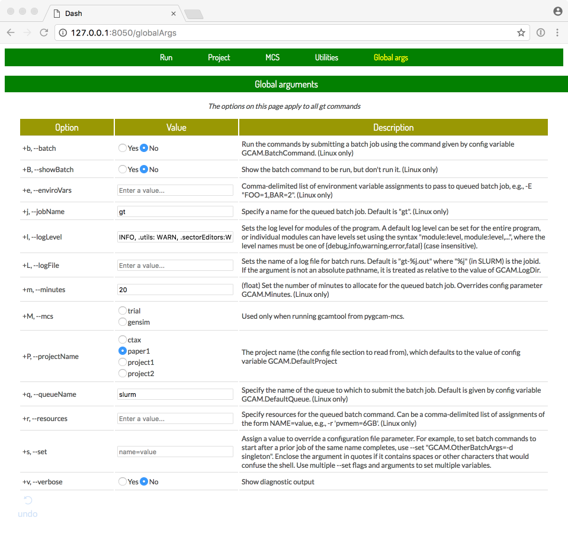

Graphical User Interface
=========================

.. note:: This feature is new and and fairly bare-bones at this point. Stay tuned...

The ``gui`` sub-command provides a browser-based graphical user interface (GUI)
on top of the :doc:`gcamtool` command. To use it, run the command

  .. code-block:: sh

     $ gt gui

This will start the web application server on your desktop computer. Point your
browser at the URL http://127.0.0.1:8050 to load the pygcam GUI application.

.. seealso::
   The :doc:`mcs/explorer` provides a separate interface for exploring Monte Carlo
   simulation results, using the same underlying web-based approach.

The pages displayed in the GUI correspond to :doc:`gcamtool` command. In fact, the pages
are generated directly from the command-line option information associated with
each command. The pages are organized into sets of related commands.

To use the GUI, select or fill in the options as desired, and click the "Run"
button. The :doc:`gcamtool` command will be run as a sub-process, with its output
displayed in the "terminal" window in the browser.

The following figure shows the GUI start page, which runs the ``gt run`` command
with the selected arguments.

.. image:: images/gt-gui.png

Setting global arguments
-------------------------
In :doc:`gcamtool`, arguments given on the command-line before the sub-command, such
as ``+P project-name``, affect all sub-commands. These can be specified on the
``Global args`` page, as shown below.

Running the GUI on a remote system
-------------------------------------

.. note:: You probably don't want to run GCAM on a login node on a cluster
   system. You can select the ``+b`` flag on the "Global args" page to have
   the task queued on the cluster, but the GUI doesn't currently provide
   any way to track the job or see the results.

Use ``ssh`` to login to the remote machine, using the ``-L`` option
to indicate that port 8050 on your desktop computer should be forwarded
to port 8050 on ``localhost`` (interpreted from the remote system's
perspective, i.e., the remote system itself.)

  .. code-block:: sh

     $ ssh -L 8050:localhost:8050 username@remote.host.name

Of course, change ``username`` and ``remote.host.name`` to appropriate values.

Once logged into the remote system, run the MCS Explorer there, with the command:

  .. code-block:: sh

     $ gt gui

This will start the web application server on the remote system. Point a browser
on your desktop computer at the URL http://localhost:8050 to load the MCS Explorer
application.
