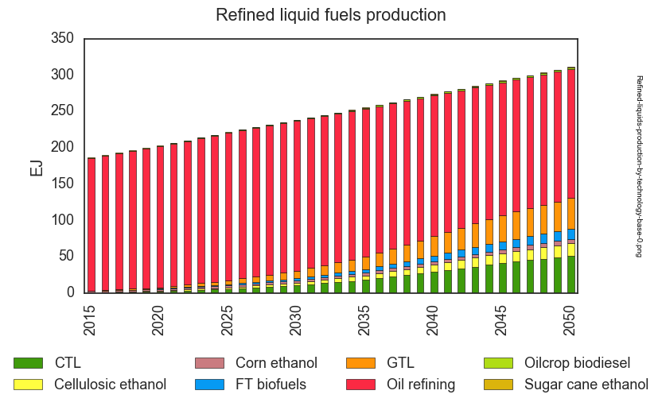
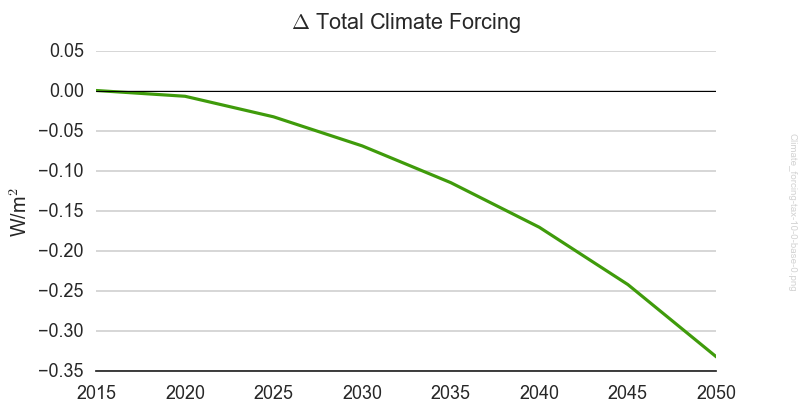
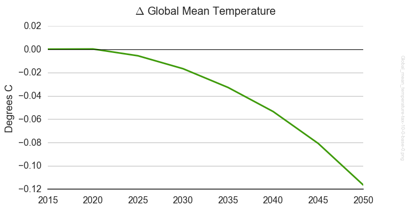
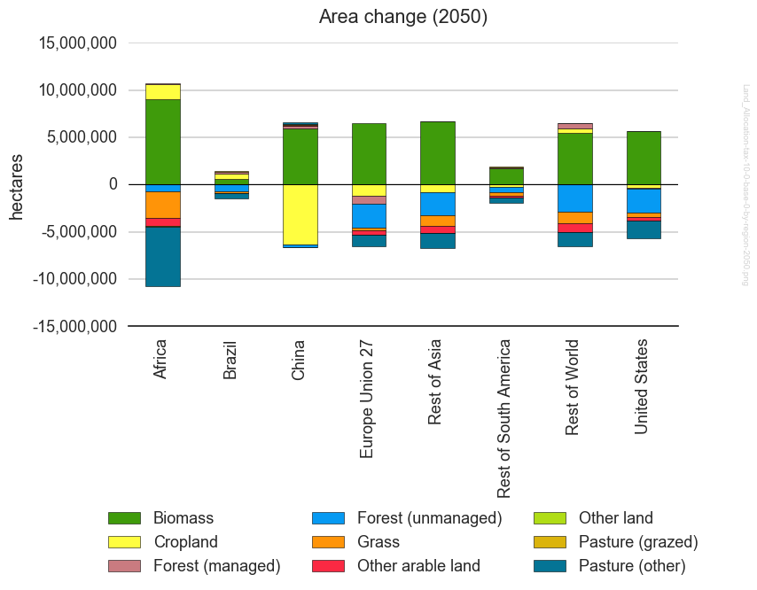
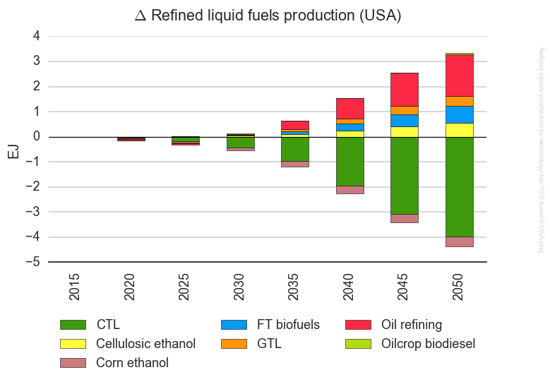
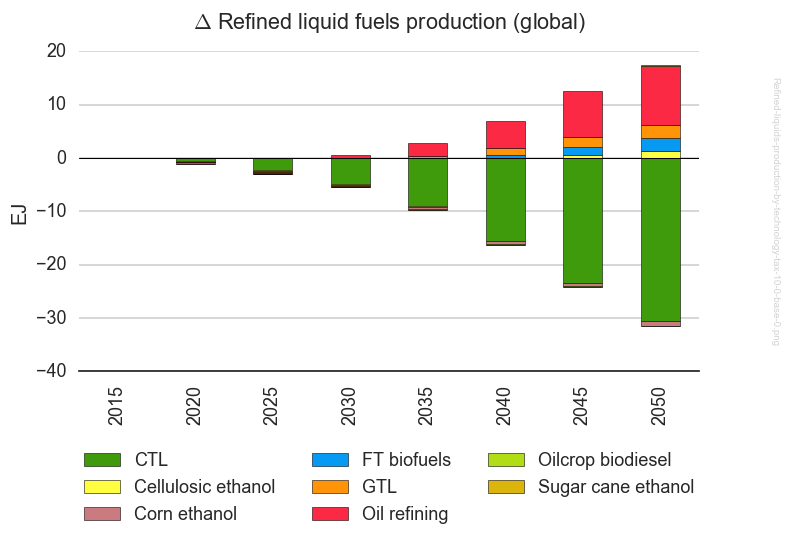
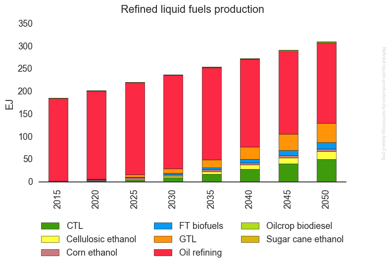
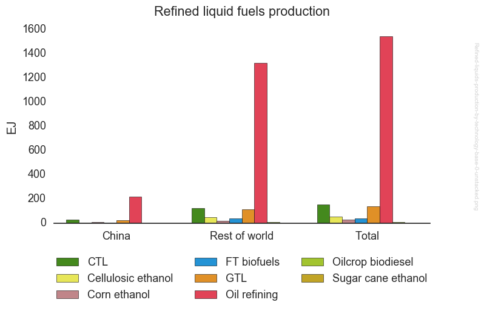

Tutorial, Part 3
==================

In :doc:`tutorial2`, we created a new project called "ctax",
examined some of its characteristics, and run a few scenarios.

Here, in Part 3, we will examine the output files and customize
some of the generated charts.

3.1 Examine output files
^^^^^^^^^^^^^^^^^^^^^^^^^^^^
We can check where the output files are going by querying the configuration
system. The ``config`` sub-command takes uses the given argument as a
regular expression to match a portion of any config variable name. It's
case-insensitive by default. So you can find out where the sandbox dir is
by running

.. code-block:: bash

   $ gt config sand

   [ctax]
   GCAM.SandboxDir = /Users/rjp/ws/paper1/
   GCAM.SandboxFilesToLink = input libs exe/gcam.exe
   GCAM.SandboxProjectDir = /Users/rjp/ws/paper1
   GCAM.SandboxRefWorkspace = /Users/rjp/ws/paper1/Workspace
   GCAM.SandboxRoot = /Users/rjp/ws

We could be more specific and get just the one result:

.. code-block:: bash

   $ gt config sandboxdir

   [ctax]
          GCAM.SandboxDir = /Users/rjp/ws/paper1/

Finally, if we want to use the result in a script or in command, we can
get a "clean" copy of the value by using the ``-x`` flag. In this case,
the value is used verbatim, and it is case-sensitive. Here we use the
value directly in an ``cd`` command.

::

   $ gt config GCAM.SandboxDir -x
   /Users/rjp/ws/paper1/

   # The backquotes evaluate the command and return its output:
   $ cd `gt config GCAM.SandboxDir -x`
   $ ls -l
   total 0
   drwxrwx---  5 rjp  staff  272 Sep 25 15:37 Workspace/
   drwxrwx---  5 rjp  staff  306 Sep 25 15:47 base-0/

   $ cd base-0
   $ ls -l
   total 32
   lrwxrwxr-x  1 rjp  staff   36 Sep 25 15:37 dyn-xml@ -> /Users/rjp/ws/ctax/Workspace/dyn-xml
   drwxrwx---  3 rjp  staff  272 Sep 25 15:56 exe/
   lrwxrwxr-x  1 rjp  staff   34 Sep 25 15:37 input@ -> /Users/rjp/ws/ctax/Workspace/input
   lrwxrwxr-x  1 rjp  staff   33 Sep 25 15:37 libs@ -> /Users/rjp/ws/ctax/Workspace/libs
   lrwxrwxr-x  1 rjp  staff   38 Sep 25 15:37 local-xml@ -> /Users/rjp/ws/ctax/Workspace/local-xml
   drwxrwx---  3 rjp  staff  408 Sep 25 15:58 output/
   drwxrwx---  4 rjp  staff  306 Sep 25 15:58 queryResults/

The CSV files are in the ``queryResults`` directory, and generated plots are in the ``figures``
directory within. The ``queries`` directory holds the queries that were extracted from the
``Main_queries.xml`` file to run them in ModelInterface in batch model.

::

   $ cd queryResults/
   $ ls -lR
   total 160
   -rw-rw-r--  1 rjp  staff    447 Sep 25 15:58 Climate_forcing-base-0.csv
   -rw-rw-r--  1 rjp  staff    468 Sep 25 15:58 Global_mean_temperature-base-0.csv
   -rw-rw-r--  1 rjp  staff  20849 Sep 25 15:58 Land_Allocation-base-0.csv
   -rw-rw-r--  1 rjp  staff  38000 Sep 25 15:58 Refined-liquids-production-by-technology-base-0.csv
   drwxr-xr-x  2 rjp  staff    102 Sep 25 15:58 figures/
   -rw-rw-r--  1 rjp  staff   7389 Sep 25 15:58 mi.log
   drwxrwx---  2 rjp  staff    238 Sep 25 15:47 queries/

    ./figures:
    total 80
    -rw-rw-r--  1 rjp  staff  38399 Sep 25 15:58 Refined-liquids-production-by-technology-base-0.png

    ./queries:
    total 112
    -rw-rw-r--  1 rjp  staff   1459 Sep 25 15:49 Climate_forcing.xml
    -rw-rw-r--  1 rjp  staff   1495 Sep 25 15:49 Global_mean_temperature.xml
    -rw-rw-r--  1 rjp  staff  38788 Sep 25 15:49 Land_Allocation.xml
    -rw-rw-r--  1 rjp  staff   2773 Sep 25 15:49 Refined-liquids-production-by-technology.xml
    -rw-rw-r--  1 rjp  staff   2970 Sep 25 15:49 generated-batch-query.xml

Here's the generated figure:

3.2 Run policy cases for default scenario group
^^^^^^^^^^^^^^^^^^^^^^^^^^^^^^^^^^^^^^^^^^^^^^^^^^^^
Now we run the policy cases, i.e., everything but the
baseline. Similar to the ``-k`` flag, which skips steps,
we can use the ``-K`` flag to skip scenarios. Since we
already ran ``base-0``, we'll skip it and run all the
policy scenarios.

::

    $ gt run -K base-0

Or, if we prefer, we can run just one policy scenario:

::

    $ gt run -S tax-10-0

3.3 Examine policy case results
^^^^^^^^^^^^^^^^^^^^^^^^^^^^^^^^^^^
Policy cases produce more results than do baselines since they also
compute and plot differences from the baseline. The ``queryResults``
directory looks similar to that for the baseline scenario, but there
is now also a ``diffs`` directory:

::

    $ cd ../../tax-10-0/
    $ ls
    diffs/        dyn-xml@      exe/          input@        local-xml@    output/       queryResults/

    $ cd diffs
    $ ls
    Climate_forcing-tax-10-0-base-0.csv                           diffs.xlsx
    Global_mean_temperature-tax-10-0-base-0.csv                   figures/
    Land_Allocation-tax-10-0-base-0.csv                           tax-10-0-annual.xlsx
    Refined-liquids-production-by-technology-tax-10-0-base-0.csv

    $ ls -lR
    total 416
    -rw-rw-r--  1 rjp  staff     273 Sep 22 18:57 Climate_forcing-tax-10-0-base-0.csv
    -rw-rw-r--  1 rjp  staff     299 Sep 22 18:57 Global_mean_temperature-tax-10-0-base-0.csv
    -rw-rw-r--  1 rjp  staff    8221 Sep 22 18:57 Land_Allocation-tax-10-0-base-0.csv
    -rw-rw-r--  1 rjp  staff   22360 Sep 22 18:57 Refined-liquids-production-by-technology-tax-10-0-base-0.csv
    -rw-rw-r--  1 rjp  staff   39411 Sep 22 15:32 diffs.xlsx
    drwxr-xr-x  2 rjp  staff     272 Sep 22 18:22 figures/
    -rw-rw-r--  1 rjp  staff  123476 Sep 22 15:32 tax-10-0-annual.xlsx

    ./figures:
    total 400
    -rw-rw-r--  1 rjp  staff  30029 Sep 22 18:57 Climate_forcing-tax-10-0-base-0.png
    -rw-rw-r--  1 rjp  staff  30280 Sep 22 18:57 Global_mean_temperature-tax-10-0-base-0.png
    -rw-rw-r--  1 rjp  staff  59195 Sep 22 18:57 Land_Allocation-tax-10-0-base-0-by-region-2050.png
    -rw-rw-r--  1 rjp  staff  35138 Sep 22 18:57 Refined-liquids-production-by-technology-tax-10-0-base-0-USA.png
    -rw-rw-r--  1 rjp  staff  37023 Sep 22 18:57 Refined-liquids-production-by-technology-tax-10-0-base-0.png

Notice that there's are also two XLSX files generated: ``diffs.xlsx`` and ``tax-10-0-annual.xlsx``.
Each an Excel workbook with all query differences results, one query per worksheet, with an index
with links on the first worksheet. The difference is that the file ``tax-10-0-annual.xlsx`` shows
values interpolated between time-step years, whereas ``diffs.xlsx`` is just the difference from the
queries as produced by GCAM.

Here are the generated figures for the differences from the baseline:

---------

---------

---------

---------

---------

---------

3.4 Modify plot appearance
^^^^^^^^^^^^^^^^^^^^^^^^^^^^^^
The ``chart`` sub-command offers numerous options to control the appearance
of figures.

 .. note::
    See :doc:`project-xml` for a detailed description of the elements
    of ``project.xml`` files.

Open the file ``project.xml``, found in the ``etc`` directory within the
project directory for the ``ctax`` project. Observe the following:

  - There are 2 "steps" that generate plots, one that generates plots
    for a single baseline or policy scenario (line 32), and another that plots
    differences between a policy scenario and the baseline (line 36), based on
    the files generated by the "diff" step (line 35).

  - The command-line arguments for the scenario plots commands are organized in
    two areas. Line 58 defines a variable called ``scenPlotArgs``, which holds
    arguments common to all scenario plots, for convenience. The arguments there are:

::

    -D {batchDir} --outputDir figures --years {years} --label --labelColor black --box

Where:
    - ``-D {batchDir}`` indicates the directory in which files are found. The value
      ``{batchDir}`` is filled in at run-time, since it differs for each scenario.
    - ``--outputDir figures`` indicates that plots should be written in the directory
      ``figures``, relative to the directory specified with ``-D``.
    - ``--years {years}`` says to plot results for this range of years. The value for
      ``{years}`` is defined at line 11. This is defined in a variable to allow the
      range to be changed consistently for all plots by changing either the start or
      end years, defined at lines 9 and 10, which in turn form the value for ``years``
    - ``--label`` requests that a label be rendered down the right side of the figure
      with the name of the file.
    - ``--labelColor black`` requests that the label on the right side should be black.
    - ``--box`` draws a box around the plot.

  - There is only one scenario plot defined, at line 63, which plots the data in the file
    ``Refined-liquids-production-by-technology-{scenario}.csv``, where ``{scenario}``
    is replaced by the current scenario being evaluated. CSV files generated by
    queries are named by the query name (with spaces replaced by hyphens)
    followed by the scenario name, and with a preceding hyphen. The remainder of line
    provides arguments specific to that plot:

    .. code-block:: bash

       -Y EJ -I technology -i -T 'Refined liquid fuels production' -c region -n 4

    - ``-Y EJ`` sets the y-axis label to "EJ"
    - ``-i`` indicates that the data should be annually interpolated
    - ``-T 'Refined liquid fuels production'`` sets the plot title
    - ``-c region`` specifies that the "region" column in the data file should be
      presented as the segments in the stacked bar chart and in the legend.
    - ``-n 4`` indicates that the legend should be presented in 4 columns.

We will now modify the plot slightly. We'll start by copying row  Let's make the label
light grey, rather than black, and we'll remove the box around the plot. Remove the ``--box``
argument and change ``black`` to ``grey``. Let's also add a new argument, ``-O`` (letter O,
not zero) which causes the plot to be opened after it is created. This works on Macs and Windows
computers, and may work on Linux depending how your window system is configured. Otherwise,
navigate in a file browser to the directory ``ctax/base-0/queryResults/figures`` in the
run-time directory for the project, which you can recover by running:

::

    $ gt config sandboxroot

We'll also change the number of columns in the legend by changing ``-n 3`` on line 62 to ``-n 4``,
and remove the interpolated annual values to plot only the 5-year time-steps. Just remove ``-i``
on line 62.

To see the modified plot, rerun the "plot" step for the ``base-0`` scenario:

::

    $ gt run -s plot -S base-0

It should look like this:

Finally, let's present the information as an "unstacked" barchart format,
split out by one region, rest-of-world, and total. Let's also add a suffix
to the generated filename that distinguishes it from the original figure,
and also generates PDF rather than PNG format. To do this, add this line
after line 62 (note that the line is split here for legibility):

::

    <text>Refined-liquids-production-by-technology-{scenario}.csv -x unstacked.pdf \
    -u technology -U China -Y EJ -T 'Refined liquid fuels production' -n 3</text>

The new arguments are these:

  - ``-x unstacked.pdf`` Results in the filename
    ``Refined-liquids-production-by-technology-base-0-unstacked.pdf``
  - ``-u technology`` indicates to generate an unstacked bargraph using
    the values in the "technology" column of the query results. Note
    that the time-step values are summed over the entire time horizon.
  - ``-U China`` says to split out China from the rest of the world.

The result should look like this:

.. note:: Run the command ``gt chart -h`` to list the options available
   to affect plot generation.

3.5 Run second scenario group
^^^^^^^^^^^^^^^^^^^^^^^^^^^^^^^^^^^^^^^^^^^^^^^^^^^^
We would like to run the other scenario group, but
we've forgotten its name. We use the ``-G`` flag to
list scenario groups:

::

    $ gt run -G
    Scenario groups:
      protect-0
      protect-90

Before running the commands, let's examine the steps that would run, using
the ``-n`` flag:

::

   $ gt run -g protect-90 -n

This results in a fairly long list of commands which don't display nicely here
so we won't attempt to show them.

Now we run all steps of all scenarios in group ``protect-90`` with this command:

::

   $ gt run -g protect-90

3.6 Run an entire project
^^^^^^^^^^^^^^^^^^^^^^^^^^^^^^^^^^^
We have been running scenarios and scenario groups individually
until now, but we can also run the entire project with a single short
command:

::

    $ gt run -a

Without the ``-a`` flag, all steps for all scenarios in the default
scenario group would be run.

3.7 Run on a computing cluster
^^^^^^^^^^^^^^^^^^^^^^^^^^^^^^^^^^^
We can batch the job on SLURM by adding a single command-line option.

::

    $ gt +b run

We can set the default time limit in our configuration file, or we can
set it on the command-line.

The ``+B`` flag displays what would occur if we ran in batch mode. The command
(minus the batch-related arguments) is written as a script to a temporary file,
which is then queued using the ``sbatch`` command. The script deletes itself.

::

    $ gt +b +m 60 +j job1 +B run

    2016-09-25 15:16:51,666 INFO Creating batch script '/people/plev920/tmp/tmprpRPq7.pygcam.sh'

    sbatch -p short,slurm --nodes=1 -J job1 -t 01:00:00 --get-user-env=10L -s -A GCAM -n 3 \
    -o /people/plev920/ws/paper1/log/gt-%j.out -e /people/plev920/ws/paper1/log/gt-%j.out \
    /people/plev920/tmp/tmprpRPq7.pygcam.sh

    Script file '/people/plev920/tmp/tmprpRPq7.pygcam.sh':

    #!/bin/bash
    rm -f /people/plev920/tmp/tmprpRPq7.pygcam.sh
    $ gt +m 60 +j job1 run

.. _sample-config-label:

Sample configuration file
^^^^^^^^^^^^^^^^^^^^^^^^^^^
Below is a sample configuration file for the ``ctax``. By convention,
variables are named with a prefix identifying where they are defined. All variables
defined by ``pygcam`` begin with ``GCAM.``, so if you create your own variables (e.g.,
to define values used in defining other variables) you should avoid confusion by avoiding
this prefix. You can use any prefix desired, or none at all.

.. code-block:: cfg

   [DEFAULT]
   GCAM.DefaultProject = ctax
   GCAM.Version        = 4.3

   GCAM.ProjectRoot    = %(Home)s/GCAM/projects
   GCAM.SandboxRoot    = %(Home)s/GCAM/sandboxes

   GCAM.LogLevel       = INFO
   GCAM.MI.LogFile     = %(Home)s/tmp/mi.log
   GCAM.MI.Dir         = /pic/projects/GCAM/ModelInterface

   GCAM.OtherBatchArgs = -A my_account

   # 'gt config -e' will run this command on .pygcam.cfg
   GCAM.TextEditor     = open -a emacs

   # Generate config files that do not write files we don't need
   GCAM.WriteDebugFile     = False
   GCAM.WritePrices        = False
   GCAM.WriteXmlOutputFile = False
   GCAM.WriteOutputCsv     = False

   [ctax]
   GCAM.RewriteSetsFile	   = %(GCAM.ProjectDir)s/etc/rewriteSets.xml
   GCAM.ScenarioSetupFile  = %(GCAM.ProjectDir)s/etc/scenarios.xml
   GCAM.LogLevel           = DEBUG
